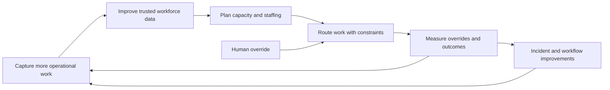

# AI-enabled workforce operations

## At a glance

| | |
| --- | --- |
| **Role** | Product leadership across workforce operations, platform workflows, and reliability |
| **Scope** | Six operations teams and more than 100 daily capacity and staffing decisions |
| **Stage** | Multi-phase operational platform evolution |
| **Personal ownership** | Problem framing, roadmap sequencing, operating-model design, cross-functional rollout, and measurement |
| **Evidence status** | Rounded, publicly shared outcomes. The manual-reassignment percentage is intentionally withheld pending metric-definition reconciliation. |

## Context

A high-volume healthcare operations organization depended on multiple teams to process time-sensitive work. Staffing and allocation decisions were frequent, but performance data was fragmented and parts of the workflow sat outside the assignment system.

The product challenge was not simply to add automation. It was to create a trustworthy operating model first, then automate decisions without removing the controls needed by operations leaders.

## Users and jobs to be done

- **Operations leaders:** understand capacity, demand, and staffing risk before service levels are affected.
- **Team managers:** allocate work to appropriately skilled and certified people.
- **Operations agents:** receive clear, relevant work without unnecessary reassignment.
- **Engineering and support teams:** diagnose platform failures quickly and manage user access safely.

## Evidence and problem framing

Three signals shaped the roadmap:

1. Occupancy and utilization were not available through one trusted system of record.
2. Approximately 30% of labor activity occurred outside the task-assignment workflow, distorting capacity and SLA planning.
3. Manual allocation, access changes, and incident diagnosis created recurring operating cost.

I treated these as a connected product-system problem: measurement, workflow coverage, decision automation, and platform reliability had to improve together.

## Product strategy

### 1. Establish trusted measurement

Build the first shared view of workforce performance and make it useful in daily operating decisions—not merely another reporting surface. Occupancy and utilization became inputs to more than 100 daily capacity and staffing decisions across six teams.

### 2. Bring hidden work into the platform

Diagnose why work bypassed task assignment, then migrate it into the tracked workflow. This improved labor-model accuracy from approximately 70% to 92% and created a better foundation for forecasting.

### 3. Automate allocation with operational constraints

Roll out ML-based routing that considered skills, certifications, and urgency. The goal was not maximum automation; it was fewer unnecessary handoffs while protecting safety and service-level requirements. Manual reassignments declined; the exact public percentage is withheld until the baseline and measurement window are reconciled.

### 4. Improve platform control and resilience

Replace a 16-step engineering runbook with self-serve role-based access control, removing engineering from approximately 95% of access changes. In parallel, address recurring production failures and introduce AI-assisted incident diagnosis and triage. Production incidents fell by approximately 35%, while resolution time improved by approximately 40%.

## Key decisions and trade-offs

- **Trust before optimization:** routing quality would be difficult to evaluate while labor data remained incomplete, so measurement and workflow coverage preceded broader automation.
- **Human override as a product feature:** operations retained the ability to intervene in exceptional cases; override behavior could then become a learning signal.
- **Progressive rollout:** routing expanded by workflow and team, allowing behavior and operational impact to be compared before broader adoption.
- **Operational ownership:** self-serve access reduced engineering dependency, but only after roles and lifecycle controls were explicit.

## Outcome

The platform evolved from reactive task administration into a more measurable operating system for workforce decisions. The most important result was not a single model or dashboard; it was a reinforcing loop between better workflow coverage, more reliable data, improved allocation, and faster operational response.

## Product artifact: the reinforcing platform loop

The sequencing mattered: broader automation came after workflow coverage and measurement improved. Override behavior remained visible so that exceptions could inform later product decisions.

## What I would test next

- Match-quality and override rates by workflow, urgency, and certification.
- Forecast error and SLA risk before and after routing changes.
- Whether explanations for routing decisions improve operator trust.
- Leading indicators that predict incident recurrence before service impact.
