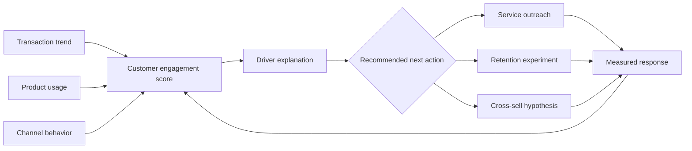

# Customer engagement score

## At a glance

| | |
| --- | --- |
| **Role** | Product lead for a cross-functional graduate capstone team |
| **Scope** | Behavioral-signal definition, analytical prototype, commercial framing, and validation plan |
| **Stage** | Proof of concept; not a production model |
| **Personal ownership** | Product question, team cadence, decision framing, and translation from analysis to an actionable workflow |
| **Evidence status** | The $27M-plus figure is a targeted opportunity estimate, not realized revenue. Production lift and predictive performance were not established. |

## Context

A financial-services capstone explored how a bank could identify declining customer engagement early enough to improve retention and cross-selling. Existing signals were distributed across transactions, product holdings, and channel behavior.

The team developed a proof of concept for a customer engagement score associated with a potential $27M-plus ARR opportunity. The figure represented the opportunity targeted by the concept, not realized revenue.

## Product question

Can fragmented behavioral signals be combined into an interpretable score that helps teams decide which customers need attention and why?

## Approach

1. Define engagement as observable behavior rather than a vague satisfaction proxy.
2. Combine transaction frequency, product portfolio, and channel usage into candidate indicators.
3. Use SQL and Python to clean, aggregate, and explore customer-level patterns.
4. Examine behaviors such as declining transaction frequency and reduced product interaction.
5. Translate the analysis into a score concept that business teams could understand and act on.

## Product decisions and trade-offs

- **Interpretability over maximum model complexity:** an actionable score needed understandable drivers, not only predictive power.
- **Trend over snapshot:** changes in behavior could be more useful than a single absolute score.
- **Actionability as a design constraint:** every signal needed a plausible response path for service, retention, or cross-sell teams.
- **Careful outcome language:** the PoC targeted a commercial opportunity; it did not claim realized revenue without a production test.

## Cross-functional execution

I led a cross-functional student team and introduced clearer milestones and Agile ceremonies. The operating cadence improved milestone completion while keeping analytical work connected to the business question; the exact retrospective percentage is not treated as a production product outcome.

## What a production validation would require

- A historical test of whether score decline predicts churn or lower share of wallet.
- Controlled outreach experiments to measure incremental retention and conversion.
- Fairness and explainability reviews across customer segments.
- Monitoring for behavior changes, missing data, and model drift.
- A feedback loop showing which interventions were attempted and whether they worked.

## Outcome

The PoC demonstrated a structured path from scattered behavioral data to an interpretable product concept. Its value was as much in defining the decision workflow and validation plan as in the score itself.

## Product artifact: interpretable score design

The score was deliberately paired with driver explanations and a measurable response path. Without those, it would have been a ranking mechanism rather than a product decision tool.
