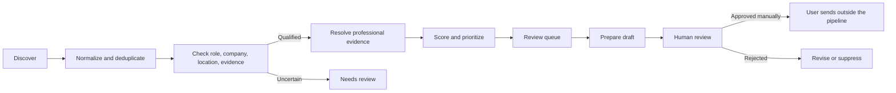

# Product Leader Radar

## At a glance

| | |
| --- | --- |
| **Role** | Product owner and builder |
| **Scope** | Evidence-backed discovery, qualification, enrichment, review queues, and draft preparation |
| **Stage** | Working private system with a separate synthetic public demonstration |
| **Personal ownership** | Product definition, safety rules, provider strategy, workflow design, implementation, and reliability testing |
| **Evidence status** | System behavior is demonstrated in code and tests. Public examples are fictional; no outreach-performance claim is made. |

## Context

Professional research tools often optimize for accumulating contacts or automating messages. My actual need was different: build a small, trustworthy set of relevant product leaders and hiring decision-makers, preserve why each person was included, control provider cost, and keep every message under human review.

That made this an operating-system problem rather than a search box.

## Product principles

1. **Evidence before enrichment.** A person must have reviewable role, company, and location evidence before any work-email lookup is considered.
2. **Explicit provenance.** Publicly found, provider-returned, inferred, stale, catch-all, and verified evidence remain distinct states.
3. **Human review before communication.** The system can prepare drafts but contains no automatic-send workflow.
4. **Bounded cost.** Provider waterfalls and daily ceilings keep a missed lookup from turning into uncontrolled spend.
5. **Reliable state transitions.** Deduplication, retries, and idempotency matter as much as the happy path.

## Workflow

## Key decisions and trade-offs

### SQLite as the source of truth

Exports and dashboards are useful review surfaces, but allowing them to become competing databases would make deduplication and state transitions unreliable. A single transactional source of truth keeps the workflow auditable.

### A provider waterfall instead of a single vendor

The pipeline tries lower-cost, higher-evidence routes before paid fallbacks. A result is not accepted merely because a provider returned it; identity and company context must still match. This improves precision but intentionally sacrifices some coverage.

### Draft-only automation

Automated sending would make the system appear more complete while removing the most important quality gate. Draft preparation is idempotent, but the human remains responsible for relevance, tone, and sending.

### Primary work before optional reconciliation

A production reliability issue revealed that an optional mailbox check could delay queued job research when authentication or network access failed. The scheduler was reordered so primary queued work runs first, and optional integrations fail independently.

## What exists

The private implementation includes a Python pipeline, persistent state, a review dashboard, job-triggered intake, quota controls, exports, and tests covering core state, draft idempotency, tracking, prioritization, and synchronization. The public [Product Leader Radar Demo](https://github.com/abhishekshah1998/product-leader-radar-demo) is a clean-room, network-free slice using fictional records.

## What I would measure next

- Precision of qualified contacts after human review.
- Duplicate and stale-employer escape rates.
- Evidence coverage by source and workflow stage.
- Provider cost per reviewable contact.
- Draft rejection reasons and revision patterns.
- Queue age, retry rate, and recovery time after integration failures.

## Privacy boundary

The public demonstration includes no real people, employers, email addresses, OAuth material, provider credentials, databases, message content, or account configuration. It demonstrates product decisions and state behavior—not a contact list.
