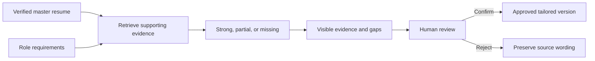

# Explainable, human-in-the-loop resume tailoring

## At a glance

| | |
| --- | --- |
| **Role** | Product owner and builder |
| **Scope** | Role analysis, evidence matching, visible review, document generation, and source-resume management |
| **Stage** | Working private prototype with a separate fictional public demonstration |
| **Personal ownership** | Product definition, workflow design, implementation, privacy boundary, and test strategy |
| **Evidence status** | Demonstrated workflow and code; no claim that a match score predicts hiring outcomes |

## Context

Tailoring a resume for each role is repetitive, but unconstrained generation creates a larger problem: fluent wording can detach from what the candidate actually did. The product needed to improve relevance while keeping the verified career record authoritative.

I reframed tailoring as evidence retrieval and review—not automatic resume writing.

## Product principles

1. **The master resume is the source of truth.** Tailored documents may select or clarify evidence but cannot silently rewrite the underlying record.
2. **Every recommendation should be inspectable.** A reviewer must be able to trace a suggested match to an existing role and bullet.
3. **Missing evidence stays missing.** A gap becomes a question for the candidate, not a generated accomplishment.
4. **Edits are visible.** The reviewer should see what changed and approve the final language.
5. **Personal material remains private.** Resumes, job descriptions, embeddings, and generated documents are not portfolio assets.

## Workflow

## Key decisions and trade-offs

### Evidence links over opaque scores

A similarity score alone can make weak evidence look authoritative. The useful output is the supporting bullet, the terms or concepts that matched, and the gaps that still require human judgment.

### Source preservation over fully generative editing

Preventing unsupported claims limits how dramatic an automated rewrite can be. That is an intentional constraint: credibility is more valuable than superficial keyword coverage.

### Semantic retrieval with a deterministic public slice

The private prototype explores semantic matching and a richer editing workflow. The public [Resume Tailor Demo](https://github.com/abhishekshah1998/resume-tailor-demo) uses transparent deterministic rules and fictional inputs so the evaluation can be understood without external APIs or private data.

### A review queue instead of one-click export

The workflow surfaces strong matches, partial matches, and unsupported requirements separately. The candidate decides whether additional verified experience exists and whether wording should change.

## What I would measure next

- Reviewer acceptance and rejection rates by recommendation type.
- Unsupported-claim escape rate after final review.
- Time from role import to approved draft.
- Whether evidence links improve reviewer confidence and correction speed.
- Difference between deterministic and semantic retrieval on a labeled test set.

## Privacy boundary

The public demonstration contains only fictional names, employers, achievements, and role requirements. The original private repository and its history remain private because they contain personal source material and previously required credential remediation.
