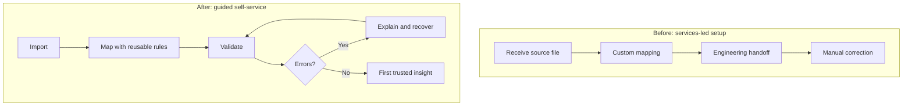

# Self-serve data onboarding and integrations

## At a glance

| | |
| --- | --- |
| **Role** | Product management for onboarding, data workflows, and B2B integrations |
| **Scope** | Customer data import, mapping, validation, exception handling, and reusable connectors |
| **Stage** | Transition from services-led setup toward guided self-service |
| **Personal ownership** | Discovery, problem framing, prioritization, workflow design, and cross-functional delivery |
| **Evidence status** | Product direction and shipped capabilities are supported. Public metric values are withheld here pending reconciliation of definitions and source records. |

## Context

A B2B data and analytics product relied on client-specific onboarding and integrations. Customers needed to import, map, enrich, and use their data quickly, but repeated setup work created delays and ongoing services dependency.

The opportunity was to turn onboarding from a sequence of custom tasks into a configurable product experience without sacrificing data quality.

## Users and jobs to be done

- **Customer administrators:** bring existing data into the platform with confidence.
- **Analysts and marketers:** access usable, well-mapped data quickly.
- **Customer success:** identify and resolve setup issues without coordinating every change through engineering.
- **Integration partners:** exchange data through predictable contracts and field mappings.

## Evidence and problem framing

Onboarding friction appeared in repeated mapping work, custom handoffs, inconsistent source formats, and delayed time to insight. Interviews and workflow observation showed that customers wanted more control, but still needed clear validation and recovery paths.

I framed the problem around time to first trusted insight rather than file-upload completion. That shifted the roadmap toward mapping, validation, error resolution, and reusable integration patterns.

## Product approach

### Standardize the onboarding workflow

Design automation around repeated setup steps while preserving clear checkpoints for customer-specific decisions. The resulting workflow reduced setup effort and time to value; the exact percentage is withheld pending metric reconciliation.

### Make data import self-serve

Launch an import and field-mapping experience that allowed customers to understand how their source data would map into the product. Adoption grew and reliance on custom integrations declined.

### Expand through reusable integrations

Prioritize integrations based on customer reach, data value, implementation reuse, and support burden. Multiple SaaS integrations reused common authentication, mapping, sync-status, and error-handling patterns.

### Validate adjacent value

Agency interviews exposed demand for white-label analytics. The capability became an adjacent offering, but its retention and revenue effects are not quantified publicly here because the underlying definitions still require confirmation.

## Key decisions and trade-offs

- **Guided self-service over unrestricted configuration:** the product exposed common mapping decisions while preventing invalid states.
- **Reusable platform primitives over one-off connectors:** shared authentication, mapping, sync-status, and error patterns improved future delivery economics.
- **Data quality as part of onboarding:** validation and exception handling were treated as core experience, not back-office cleanup.
- **Outcome-oriented prioritization:** integration count was less important than adoption, data utility, and reduced time to value.

## Outcome

The experience moved toward a product-led onboarding model: customers gained control, customer success gained visibility, and engineering could invest in reusable capabilities instead of repeated setup work.

## Product artifact: from handoffs to a reusable workflow

The design target was not merely a successful upload. It was the customer's first trusted insight, including understandable validation and a recovery path when data was incomplete or malformed.

## What I would test next

- Median time from account creation to first trusted insight.
- Mapping completion and error-recovery rates by source system.
- Percentage of onboarding completed without internal intervention.
- Integration retention, sync health, and downstream feature adoption.
